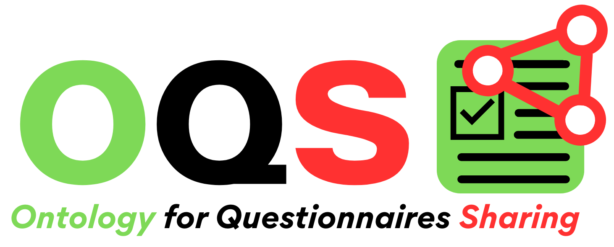

# OQS Ontology

The **OQS (Ontology for Questionnaires Sharing)** aims to represent research questionnaires and their components, ensuring persistent identifiers, provenance metadata, and versioning, in alignment with the FAIR principles. It supports the accessibility, findability, standardization, interoperability, and reuse of questionnaire elements and the data collected through these instruments.

## Access to the Ontology

The ontology is available in two ways:
- By accessing the file [`oqs.ttl`](./oqs.ttl) directly.
- Through the persistent URI: [http://purl.org/nsoluti/oqs](http://purl.org/nsoluti/oqs).
- The reference conceptual model of the ontology is visually available in the file [`oqs.png`](./oqs.png).

## Use Cases and Validation

The file [`casodeuso.ttl`](./casodeuso.ttl) contains a set of use cases that were used to validate the conceptual coverage and consistency of the OQS ontology. Each use case models a typical application scenario for questionnaires and their associated elements.

## SPARQL Queries and Results

The file [`qc.doc`](./qc.doc) presents the SPARQL queries and their corresponding results for each of the use cases. These queries demonstrate how the ontology can be queried to retrieve and validate the modeled information.

## Ontology Documentation

The complete documentation of the ontology, including detailed conceptual models, meta-properties, and usage guidelines, is available at:
- [https://github.com/nsoluti/oqs](https://github.com/nsoluti/oqs)

## License

This work is distributed under the terms of the [Creative Commons Attribution License CC BY 4.0](https://creativecommons.org/licenses/by/4.0/legalcode).
Under this license, you are free to share and adapt the material for any purpose, even commercially, provided appropriate credit is given.
